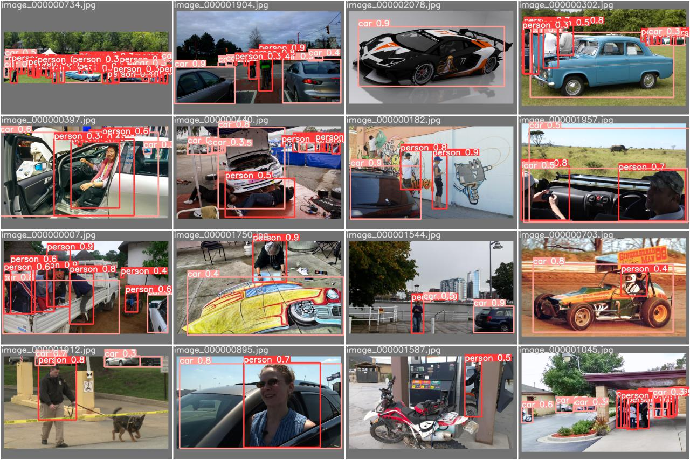
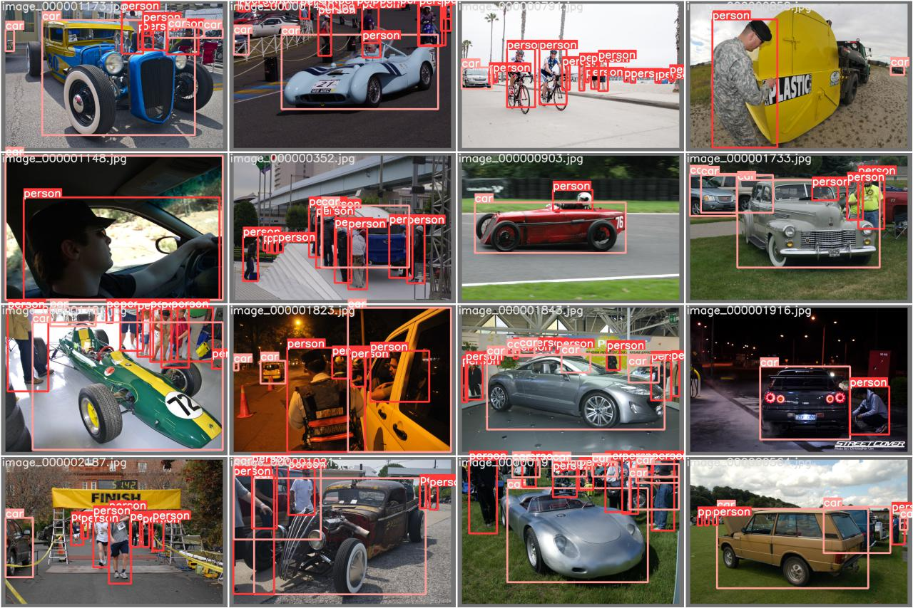
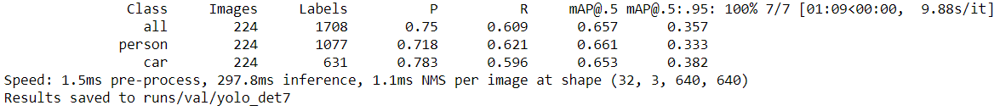
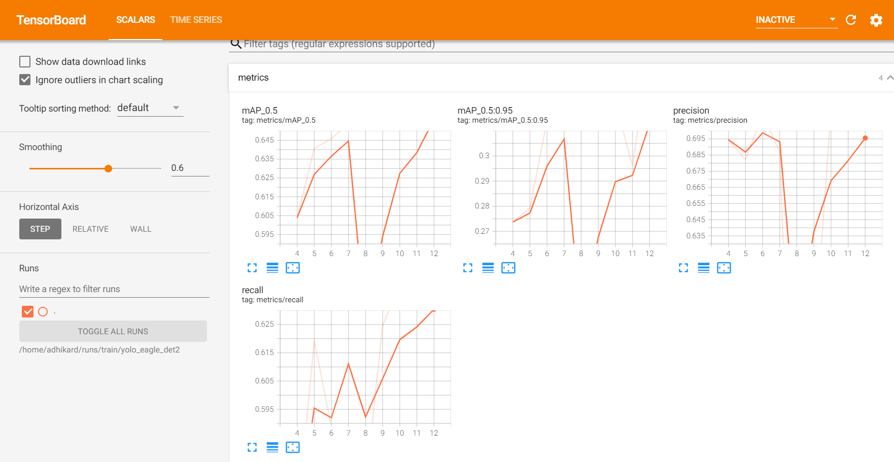

**Eagle View**

**YOLOv5 trained on custom dataset**

YOLOv5 architecture has integrated the latest innovations similar to the YOLOv4 architecture, thus there are not many brilliant differences in theory. The author did not publish a detailed paper, but only launched a repository on Github and updates improvements there. By dissecting its structure code in file .yaml, the YOLOv5 model can be summarized as follows (Jocher, 2020): - Backbone: Focus structure, CSP network - Neck: SPP block, PANet - Head: YOLOv3 head using GIoU-loss The remarkable point mentioned by the YOLOv5 author is an engineering difference. Joseph Redmon introduced the anchor box structure in YOLOv2 and a procedure for selecting anchor boxes of size and shape that closely resemble the ground truth bounding boxes in the training set. By using the k-mean clustering algorithm with different 𝑘 values, the authors picked the 5 best-fit anchor boxes for the COCO dataset (containing 80 classes) and use them as the default. That reduces training time and increases the accuracy of the network. However, when applying these 5 anchor boxes to a unique dataset (containing a class not belonged to 80 classes in the COCO dataset), these anchor boxes cannot quickly adapt to the ground truth bounding boxes of this unique dataset. For example, a giraffe dataset prefers the anchor boxes with the shape thin and higher than a square box. To address this problem, computer vision engineers usually run the k-mean clustering algorithm on the unique dataset to get the best-fit anchor boxes for the data first. Then, these parameters will be configurated manually in the YOLO architecture. Glenn Jocher proposed integrating the anchor box selection process into YOLOv5. As a result, the network has not to consider any of the datasets to be used as input, it will automatically "learning" the best anchor boxes for that dataset and use them during training. (Solawetz, 2020)

Ground Truth: 

**Predicted Truth:**

**Run Validation code :**

1. **Run : [https://github.com/DhrubaAdhikary/eagleview/blob/main/Eagleview_Inference_.ipynb**](https://github.com/DhrubaAdhikary/eagleview/blob/main/Eagleview_Inference_.ipynb)**

**On colab.**

1. **Before executing the final line upload the weights file [https://github.com/DhrubaAdhikary/eagleview/blob/main/runs/train/yolo_eagle_det2/weights/best.pt**](https://github.com/DhrubaAdhikary/eagleview/blob/main/runs/train/yolo_eagle_det2/weights/best.pt)**
1. **Then run the code :** 

python /content/yolov5/val.py --weights /content/best.pt --data eagleview.yaml --task test --name yolo\_det

**Metrics :**

